# Sprint 1 - UX/UI

Durante este sprint se definió y ejecutó el diseño visual completo del sistema TociTech, abarcando tanto la aplicación móvil desarrollada en Flutter como el panel administrativo web desarrollado en React.  
El objetivo principal fue establecer una identidad visual coherente, una experiencia de usuario intuitiva y un prototipo navegable que sirviera como guía para el desarrollo posterior del sistema.

El sprint incluyó el diseño de:

- 📱 Interfaz de la aplicación móvil para clientes (Flutter)
- 🖥️ Interfaz del panel administrativo web (React)
- 🎨 Sistema de diseño con paleta de colores, tipografía y componentes reutilizables
- 🗺️ Flujos de navegación completos por módulo

---

# 🎯 Objetivos Implementados

- Definición de la identidad visual del sistema
- Diseño de flujos de navegación completos
- Implementación de interfaz oscura moderna
- Diseño de componentes reutilizables
- Aplicación de leyes UX/UI en la interfaz
- Desarrollo de pantallas funcionales en Flutter
- Desarrollo de pantallas funcionales en React
- Prototipo navegable del sistema completo

---

# 🛠️ Tecnologías Utilizadas

| Tecnología | Uso |
|---|---|
| Flutter | Interfaz móvil multiplataforma |
| Dart | Lenguaje principal de la app |
| React.js | Interfaz del panel administrativo |
| Tailwind CSS | Estilos del panel web |
| Vite | Entorno de desarrollo frontend |

---

# 🎨 Sistema de Diseño

El sistema TociTech implementa un tema oscuro consistente en todas sus interfaces, definido mediante un archivo centralizado de estilos (`app_theme.dart` en Flutter y Tailwind CSS en React).

## Paleta de colores

| Token | Color | Uso |
|---|---|---|
| `background` | `#0F0F14` | Fondo principal de pantallas |
| `surface` | `#1A1A22` | Tarjetas, modales y superficies |
| `primary` | `#6C63FF` | Botones principales y acentos |
| `blue` | `#1E88E5` | Acciones secundarias e íconos |
| `green` | `#22C55E` | Estados activos y confirmaciones |
| `textPrimary` | `#FFFFFF` | Textos principales |
| `textSecondary` | `#FFFFFFB3` | Textos secundarios y subtítulos |
| `textMuted` | `#FFFFFF61` | Textos de baja jerarquía |

## Tipografía

La interfaz utiliza la tipografía del sistema con jerarquías bien definidas:

- **Títulos principales:** 24–26px, `FontWeight.bold`
- **Subtítulos:** 15–18px, `FontWeight.w600`
- **Cuerpo de texto:** 13–15px, peso normal
- **Textos de apoyo:** 11–13px, `textSecondary`

## Componentes reutilizables

- `ProductCard` — tarjeta de producto con imagen, nombre, precio y stock
- `ServiceCard` — tarjeta de servicio con descripción y precio
- `AppNetworkImage` — carga optimizada de imágenes con fallback
- Campos de texto con íconos, bordes sutiles y feedback visual
- Botones `FilledButton` con bordes redondeados (radius 14)

---

# 📱 Aplicación Móvil — Pantallas Diseñadas

## 🔐 Autenticación

Se diseñó un flujo de autenticación limpio con énfasis en usabilidad.

### Funcionalidades de diseño
- Header con logo y nombre de marca
- Campos de texto con íconos prefijos y toggle de visibilidad en contraseña
- Botón principal de acción con estado de carga
- Enlace de navegación hacia registro
- Validación visual de formularios

---

## 📸 Evidencias

### Inicio de sesión

<p align="center">
  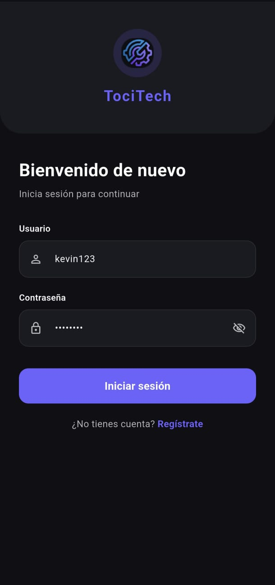
</p>

---

### Registro de usuarios

<p align="center">
  
  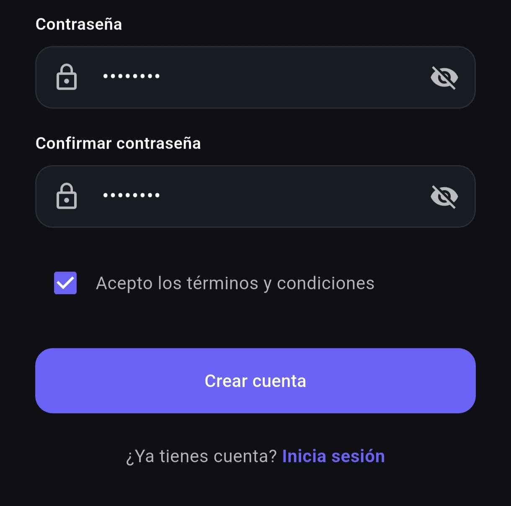
</p>

---

## 🏠 Pantalla Principal (Home)

La pantalla principal funciona como hub central de navegación del sistema.

### Funcionalidades de diseño
- AppBar con nombre de sección, notificaciones y carrito con contador
- Barra de navegación inferior con 4 módulos
- Sección de servicios destacados con tarjetas horizontales deslizables
- Sección de horarios de atención con íconos y color por estado
- Acceso directo al asistente IA

---

## 🛍️ Catálogo de Productos

El módulo de productos presenta un catálogo limpio y navegable.

### Funcionalidades de diseño
- Grilla de tarjetas con imagen, nombre, precio y badge de stock
- Estado vacío ilustrado
- Estado de carga con indicador
- Pantalla de detalle con imagen expandida y especificaciones

---

## 📸 Evidencias

### Catálogo de productos

<p align="center">
  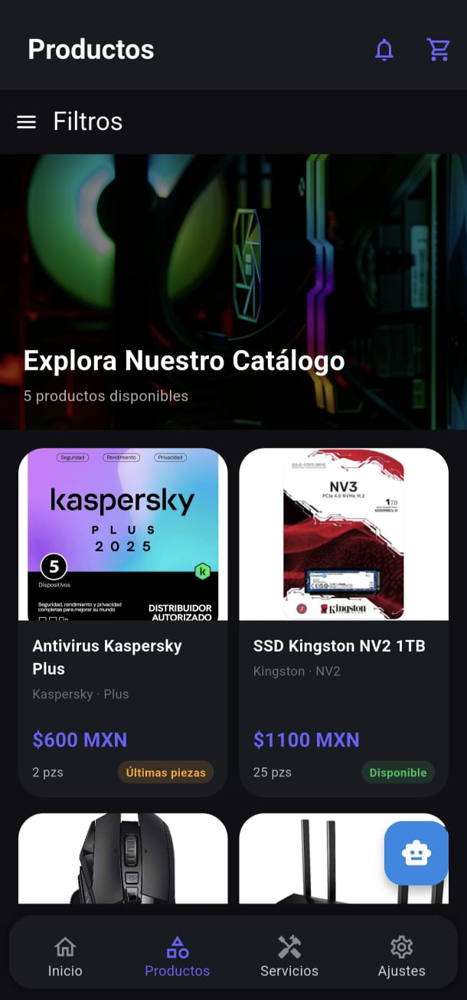
</p>

---

### Detalle de producto

<p align="center">
  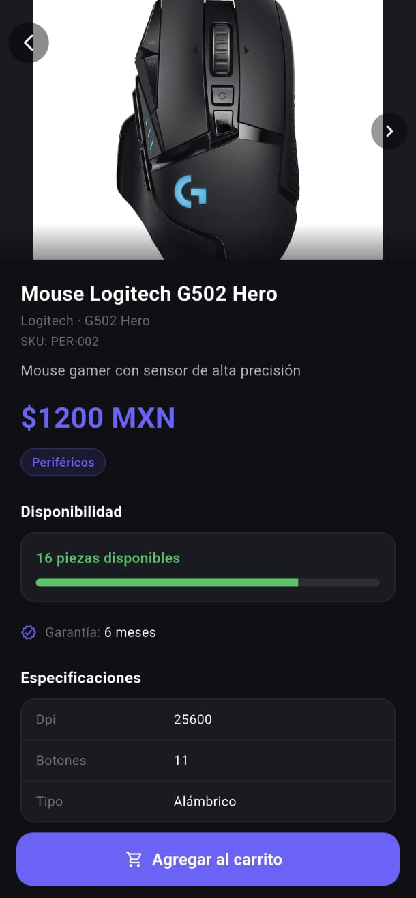
</p>

---

## 🛒 Carrito de Compras

El carrito presenta un listado de productos seleccionados con control de cantidades.

### Funcionalidades de diseño
- Listado de items con imagen, nombre, precio y controles
- Resumen de totales
- Botón de acción hacia checkout
- Estado vacío con mensaje orientador

---

## 📸 Evidencias

### Carrito de compras

<p align="center">
  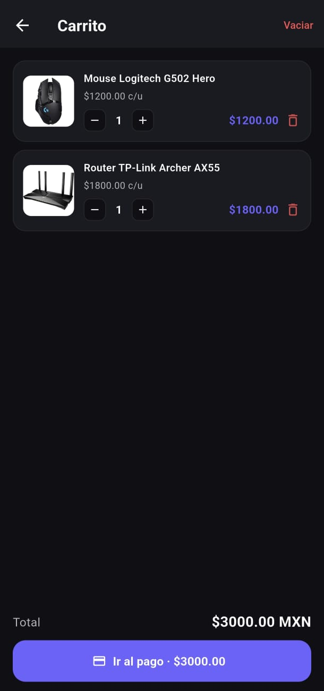
</p>

---

## 🛠️ Servicios Técnicos

El módulo de servicios presenta las opciones de reparación disponibles.

### Funcionalidades de diseño
- Tarjetas de servicio con nombre, descripción, precio y duración
- Pantalla de detalle con formulario de solicitud
- Pantalla de confirmación de solicitud exitosa

---

## 📸 Evidencias

### Catálogo de servicios

<p align="center">
  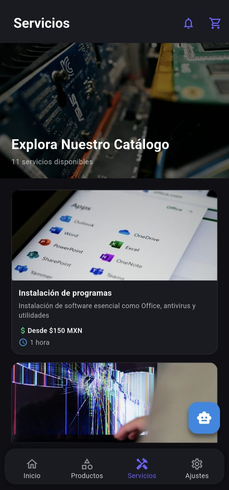
</p>

---

### Solicitud de servicio

<p align="center">
  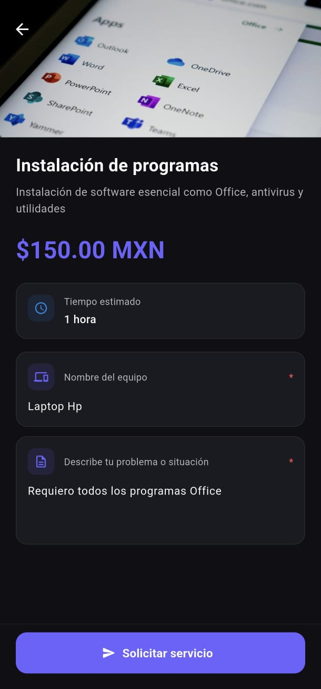
  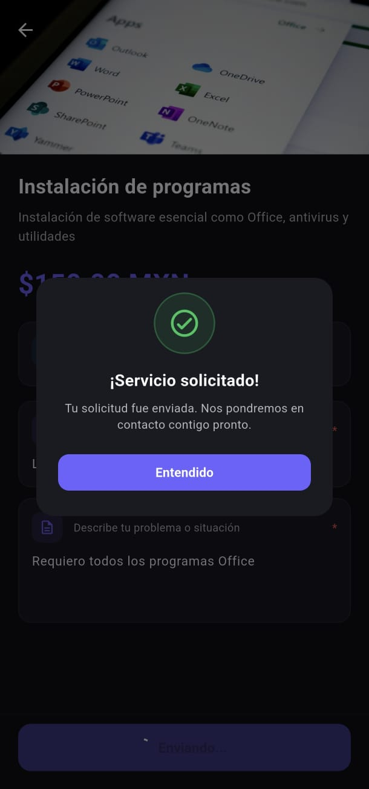
</p>

---

## 💳 Proceso de Pago

El checkout presenta un flujo de pago claro y confiable.

### Funcionalidades de diseño
- Resumen de orden antes del pago
- Integración con Stripe Payment Sheet nativa
- Pantalla de confirmación con resumen del pedido

---

## 📸 Evidencias

### Confirmación de pago

<p align="center">
  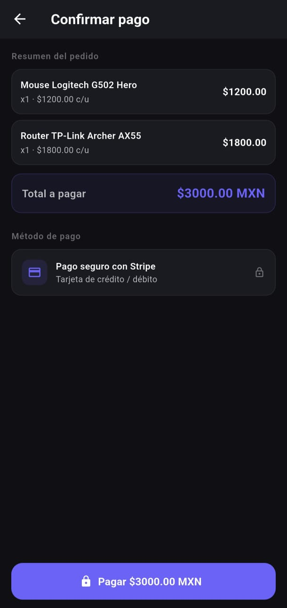
  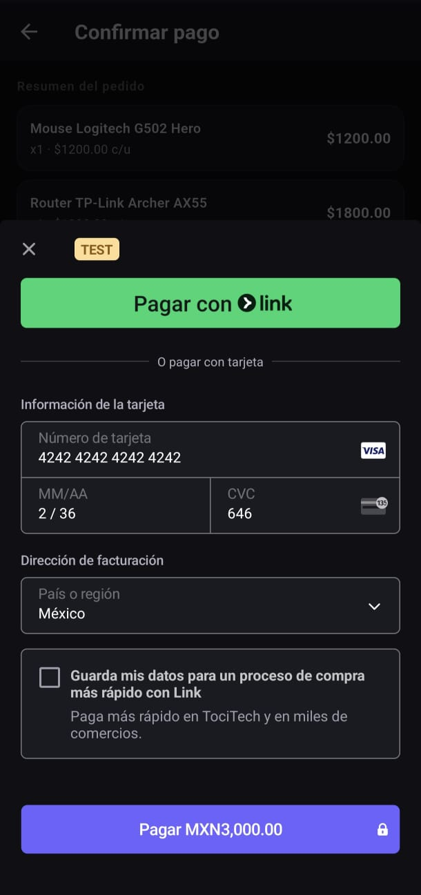
</p>

---

### Pago exitoso

<p align="center">
  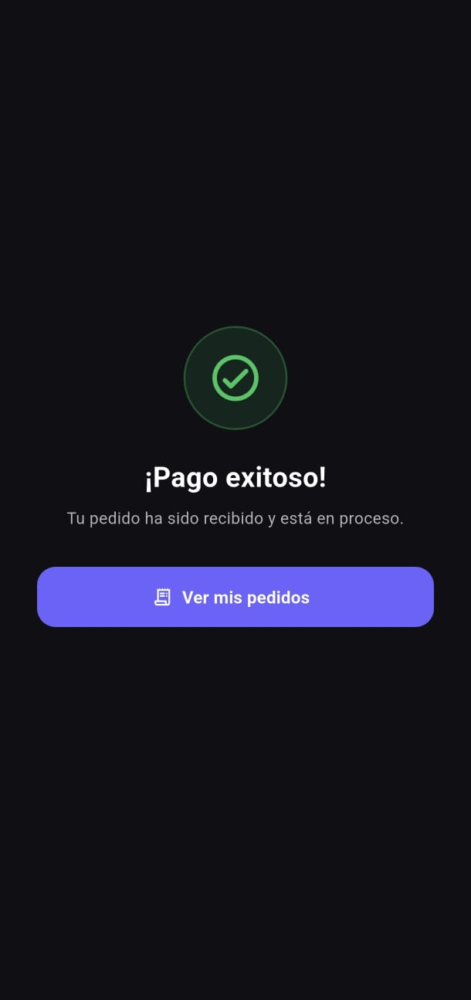
</p>

---

## 🧾 Mis Pedidos

Historial de pedidos del usuario con seguimiento de estados.

### Funcionalidades de diseño
- Listado cronológico de pedidos
- Chips de estado con colores por tipo (`PENDIENTE`, `EN_PROGRESO`, `COMPLETADO`)
- Estado vacío cuando no hay pedidos registrados

---

## 📸 Evidencias

### Historial de pedidos

<p align="center">
  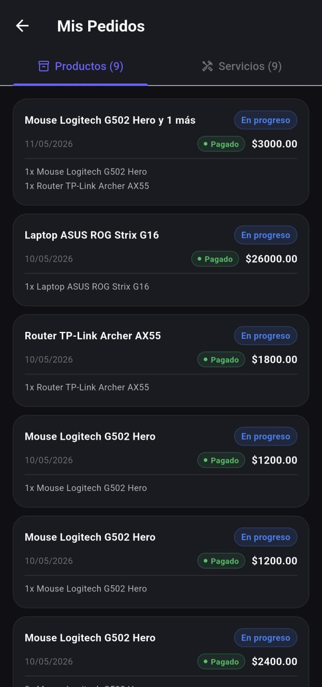
</p>

---

# 🖥️ Panel Web Administrativo — Pantallas Diseñadas

## 🔐 Login Administrativo

Pantalla de acceso exclusiva para administradores del sistema.

### Funcionalidades de diseño
- Formulario centrado con campos de usuario y contraseña
- Diseño limpio con énfasis en la acción de inicio de sesión
- Redirección automática al dashboard tras autenticación

---

## 📊 Dashboard

El dashboard es el núcleo informativo del panel administrativo.

### Funcionalidades de diseño
- KPIs principales: ventas, productos, servicios y clientes
- Gráficas de actividad semanal con Recharts
- Layout de grid responsivo
- Navegación lateral con íconos y etiquetas

---

## 📸 Evidencias

### Dashboard principal

<p align="center">
  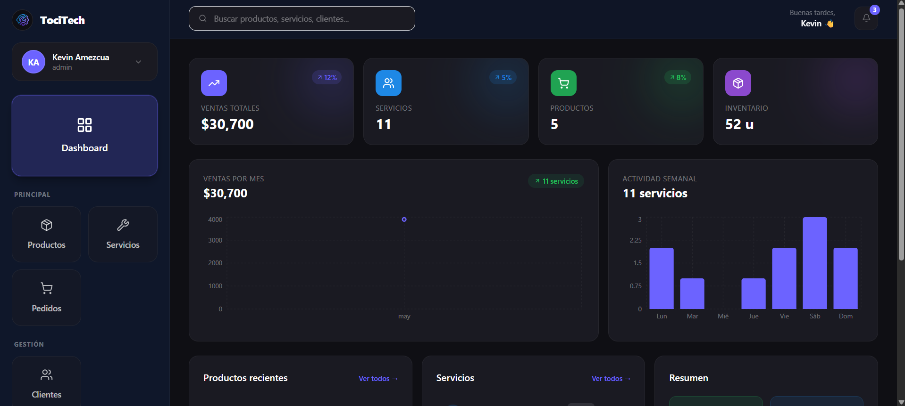
</p>

---

## 🛍️ Gestión de Productos

Vista administrativa del catálogo de productos.

### Funcionalidades de diseño
- Tabla con nombre, precio, stock y categoría
- Botones de acción por fila (editar, eliminar)
- Modal de creación/edición con formulario completo
- Buscador dinámico

---

## 📸 Evidencias

### Lista de productos

<p align="center">
  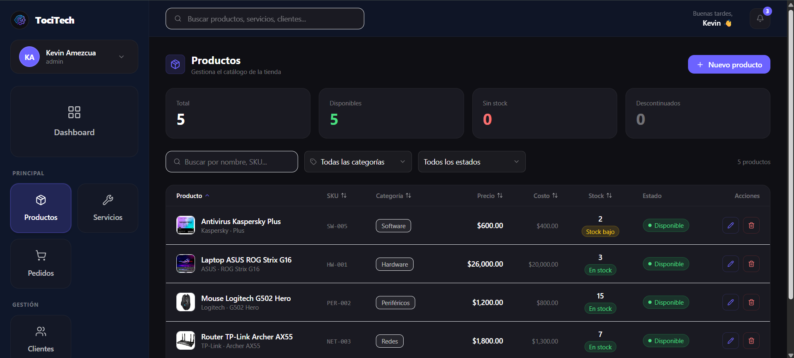
</p>

---

### Formulario de producto

<p align="center">
  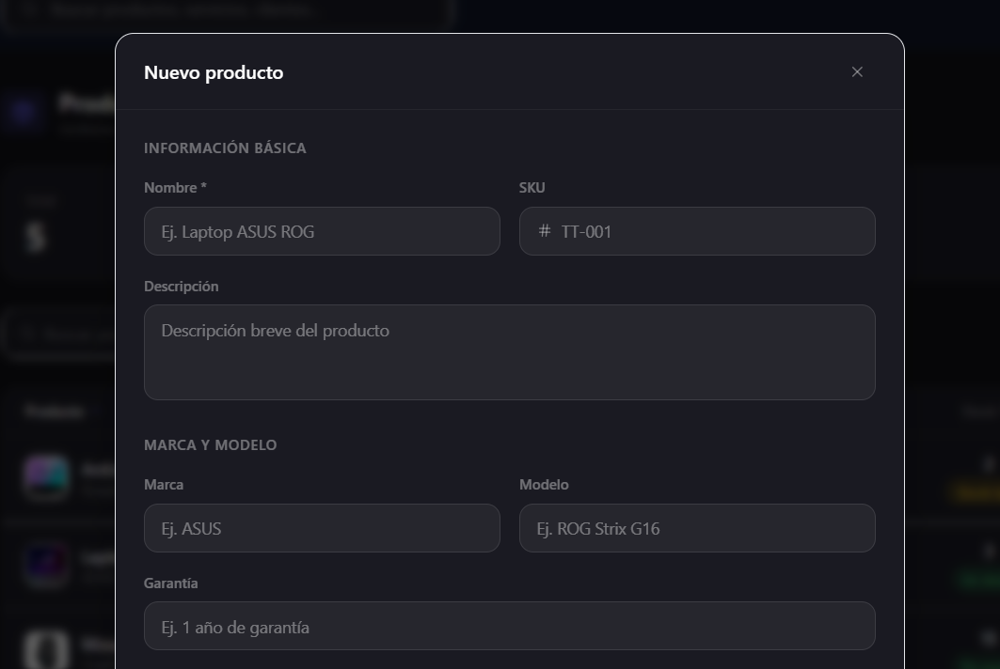
  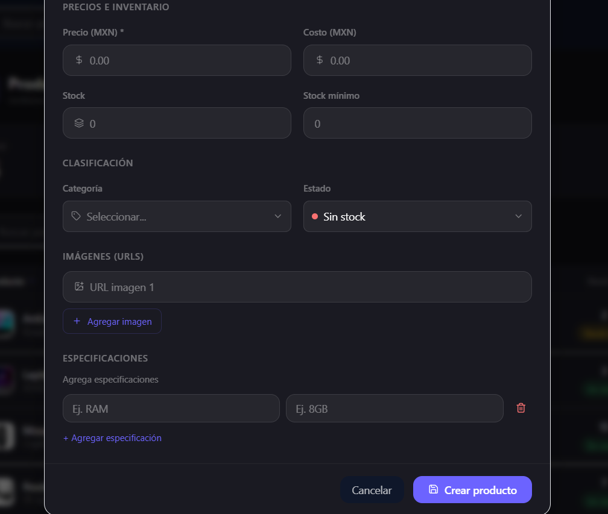
</p>

---

## 🛠️ Gestión de Servicios

Administración de los servicios técnicos disponibles.

### Funcionalidades de diseño
- Tabla de servicios con nombre, precio y duración
- Modal de creación/edición
- Acciones rápidas por fila

---

## 📸 Evidencias

### Administración de servicios

<p align="center">
  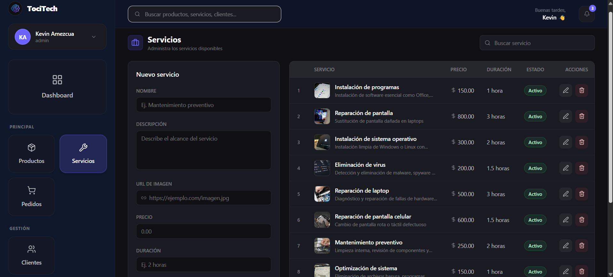
</p>

---

## 🧾 Gestión de Pedidos

Vista para seguimiento y actualización de pedidos.

### Funcionalidades de diseño
- Tabla de pedidos con estado, tipo y cliente
- Actualización de estado desde el panel
- Filtros de búsqueda

---

## 📸 Evidencias

### Gestión de pedidos

<p align="center">
  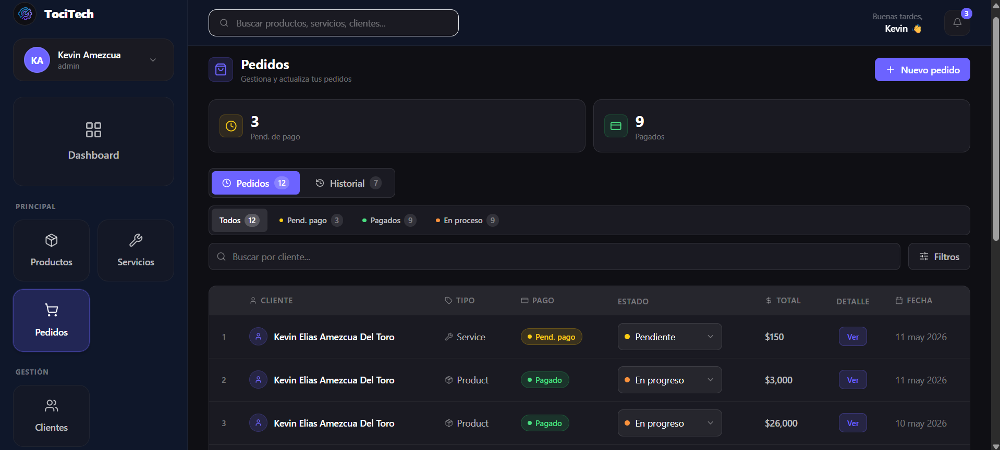
</p>

---

## 👥 Gestión de Clientes

Vista de clientes registrados en el sistema.

### Funcionalidades de diseño
- Tabla de clientes con nombre, correo y teléfono
- Consulta de historial de compras
- Diseño consistente con el resto del panel

---

## 📸 Evidencias

### Lista de clientes

<p align="center">
  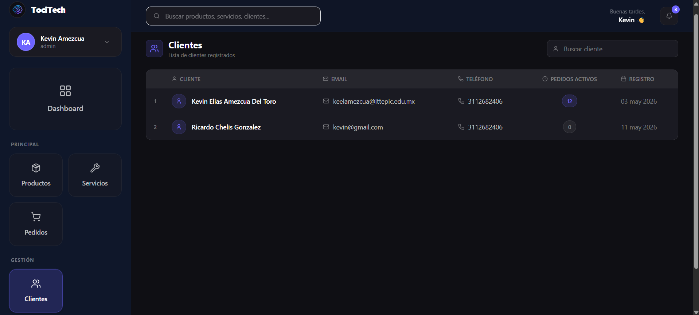
</p>

---

# 🗺️ Flujos de Navegación

## Aplicación móvil

```
Login / Registro
      │
      ▼
   Home ──────────────────────────────────────────────┐
      │                                               │
      ├── Productos → Detalle → Carrito → Checkout    │
      ├── Servicios → Detalle → Solicitud             │
      ├── Mis Pedidos                                 │
      ├── Notificaciones                              │
      ├── Búsqueda                                   │
      ├── Asistente IA                               │
      └── Ajustes / Cerrar sesión ───────────────────┘
```

## Panel administrativo

```
Login
  │
  ▼
Dashboard
  │
  ├── Productos (CRUD)
  ├── Servicios (CRUD)
  ├── Pedidos (Ver / Actualizar estado)
  ├── Clientes (Ver)
  ├── Perfil
  └── Ajustes
```

---

# ✅ Leyes UX/UI Aplicadas

| Ley | Aplicación en TociTech |
|---|---|
| **Ley de Fitts** | Botones de acción principales de tamaño grande (52px de altura) y ancho completo |
| **Ley de Hick** | Navegación limitada a 4 opciones en la barra inferior de la app |
| **Ley de proximidad** | Elementos relacionados agrupados en tarjetas con padding uniforme |
| **Ley de similitud** | Componentes reutilizables con estilo consistente en todo el sistema |
| **Ley de la región común** | Uso de superficies (`surface`) para delimitar secciones distintas |
| **Jerarquía visual** | Tamaños y pesos de fuente diferenciados por importancia del contenido |
| **Contraste** | Texto blanco sobre fondos oscuros con ratios de contraste legibles |
| **Feedback visual** | Estados de carga, botones deshabilitados y snackbars informativos |

---