# Sprint 2 - Conexiones / Flutter

Durante este sprint se desarrolló la arquitectura completa del sistema TociTech, integrando una aplicación móvil, un backend API REST y un panel administrativo web.  
El objetivo principal fue implementar un ecosistema funcional capaz de gestionar productos, servicios técnicos, pedidos, autenticación, pagos electrónicos y administración general del sistema.

El sprint incluyó el desarrollo de:

- 📱 Aplicación móvil para clientes utilizando Flutter
- 🖥️ Panel administrativo web con React
- ⚙️ Backend API REST con Node.js y Express
- 🔐 Sistema de autenticación mediante JWT
- 💳 Integración de pagos con Stripe
- 📧 Envío automático de correos con SendGrid
- ☁️ Base de datos en Firebase Firestore

La arquitectura implementada sigue un enfoque modular y escalable, permitiendo la comunicación entre cliente, servidor y servicios externos mediante peticiones HTTP y manejo de JSON.

---

# 📱 Aplicación Flutter (app_client)

La aplicación móvil fue desarrollada utilizando Flutter y Dart como solución multiplataforma para Android.  
La app consume una API REST desarrollada en Node.js y permite gestionar productos, servicios, pedidos y pagos mediante una interfaz moderna y funcional.

---

# 🎯 Objetivos Implementados

- Desarrollo de aplicación multiplataforma con Flutter
- Consumo de API REST mediante HTTP
- Manejo y procesamiento de JSON
- Persistencia local utilizando SQLite
- Integración de servicios externos
- Flujo completo de autenticación y compras
- Integración de pagos con Stripe

---

# 🛠️ Tecnologías Utilizadas

| Tecnología | Uso |
|---|---|
| Flutter | Desarrollo móvil multiplataforma |
| Dart | Lenguaje principal |
| HTTP | Consumo de API REST |
| SQLite | Persistencia local |
| Shared Preferences | Almacenamiento local |
| Cached Network Image | Carga optimizada de imágenes |
| Stripe SDK | Procesamiento de pagos |

---

# 🔐 Autenticación de Usuarios

La aplicación implementa un sistema de autenticación conectado al backend mediante API REST y JWT.

## Funcionalidades
- Inicio de sesión
- Registro de usuarios
- Validación de formularios
- Persistencia de sesión

---

## 📸 Evidencias

### Inicio de sesión

  

---

### Registro de usuarios

  
  

---

# 🛍️ Gestión de Productos

La aplicación permite visualizar un catálogo de productos consumidos desde la API REST.

## Funcionalidades
- Visualización de catálogo
- Consulta de productos
- Detalle de productos
- Disponibilidad y stock
- Manejo de imágenes

---

## 📸 Evidencias

### Catálogo de productos

  

---

### Detalle de producto

  

---

# 🛒 Carrito de Compras

La aplicación implementa un carrito de compras con persistencia local utilizando SQLite.

## Funcionalidades
- Agregar productos
- Modificar cantidades
- Eliminar productos
- Persistencia local
- Cálculo automático de totales

---

## 📸 Evidencias

### Carrito de compras

  

---

# 💳 Integración de Pagos

La aplicación integra Stripe para el procesamiento de pagos electrónicos.

## Funcionalidades
- Pago mediante tarjeta
- Stripe Payment Sheet
- Confirmación de pago
- Flujo seguro de transacciones

---

## 📸 Evidencias

### Confirmación de pago

  
  

---

### Pago exitoso

  

---

# 🧾 Gestión de Pedidos

La aplicación permite consultar el historial de pedidos realizados por el usuario.

## Funcionalidades
- Historial de pedidos
- Estado de pedidos
- Productos comprados
- Seguimiento de compras

---

## 📸 Evidencias

### Historial de pedidos

  

---

# 🛠️ Gestión de Servicios

La aplicación incluye un módulo para solicitar servicios técnicos.

## Funcionalidades
- Catálogo de servicios
- Solicitud de servicios
- Formularios dinámicos
- Confirmación de solicitudes

---

## 📸 Evidencias

### Catálogo de servicios

  

---

### Solicitud de servicio

  
  

---

# 📧 Integración de Correos Electrónicos

El sistema genera automáticamente correos de confirmación utilizando SendGrid.

## Funcionalidades
- Confirmación de compra
- Resumen de pedido
- Notificaciones automáticas

---

## 📸 Evidencias

### Correo de confirmación

  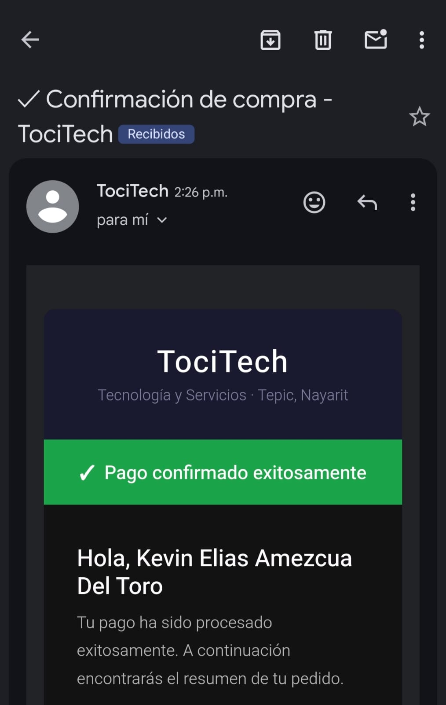
  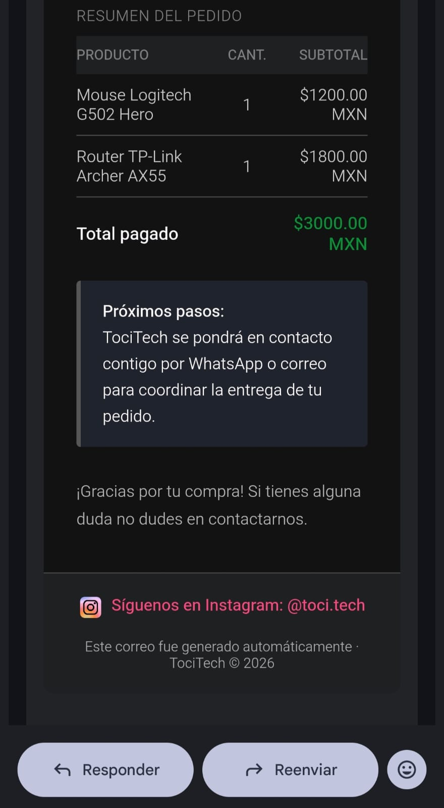

---

# 🔄 Consumo de API REST

La aplicación consume servicios REST desarrollados en Node.js utilizando peticiones HTTP y manejo de JSON.

## Funcionalidades implementadas
- GET
- POST
- PUT
- DELETE
- Manejo de respuestas JSON
- Manejo de errores
- Integración cliente-servidor

---

# 💾 Persistencia Local con SQLite

La aplicación utiliza SQLite para almacenar información localmente.

## Implementaciones
- Persistencia del carrito
- Datos temporales
- Almacenamiento local offline

---

# ⚙️ Backend API REST (backend)

El backend fue desarrollado utilizando Node.js y Express.js bajo una arquitectura cliente-servidor.  
La API REST permite gestionar autenticación, productos, servicios, pedidos, pagos y notificaciones integrando múltiples servicios externos.

---

# 🎯 Objetivos Implementados

- Desarrollo de API REST con Express
- Arquitectura modular escalable
- Autenticación mediante JWT
- Integración con Firebase Firestore
- Integración de pagos con Stripe
- Envío de correos electrónicos con SendGrid
- Integración de inteligencia artificial con Gemini AI
- Protección de rutas mediante middleware
- Manejo de peticiones HTTP y JSON

---

# 🛠️ Tecnologías Utilizadas

| Tecnología | Uso |
|---|---|
| Node.js | Entorno de ejecución |
| Express.js | Framework backend |
| Firebase Firestore | Base de datos |
| JWT | Autenticación |
| Bcrypt | Hashing de contraseñas |
| Stripe API | Procesamiento de pagos |
| SendGrid | Correos electrónicos |
| Gemini AI API | Funcionalidades inteligentes |
| Dotenv | Variables de entorno |
| Express Rate Limit | Protección API |

---

# 🏗️ Arquitectura Backend

El backend fue organizado utilizando una arquitectura modular basada en:

- Controllers
- Routes
- Models
- Middleware
- Configuración de servicios externos

---

## 📸 Evidencias

### Estructura del backend

  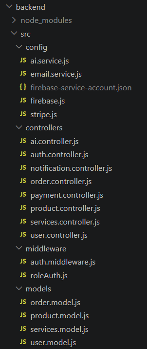
  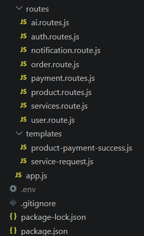

---

# 🚀 Ejecución del Servidor

El backend permite ejecutar una API REST local mediante Node.js.

## Funcionalidades
- Inicialización del servidor
- Configuración de variables de entorno
- Middleware global
- Manejo de rutas

---

## 📸 Evidencias

### Servidor en ejecución

  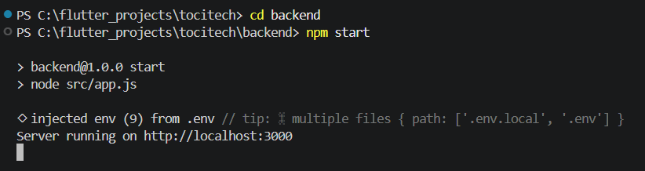

---

# 🔐 Sistema de Autenticación

La API implementa autenticación segura mediante JWT y cifrado de contraseñas.

## Funcionalidades
- Registro de usuarios
- Inicio de sesión
- Generación de tokens JWT
- Protección de endpoints
- Validación de credenciales

---

## 📸 Evidencias

### Registro de usuarios

  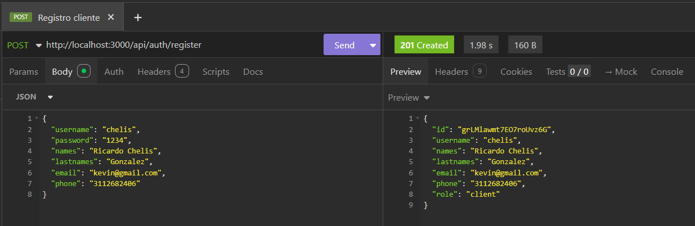

---

### Inicio de sesión y JWT

  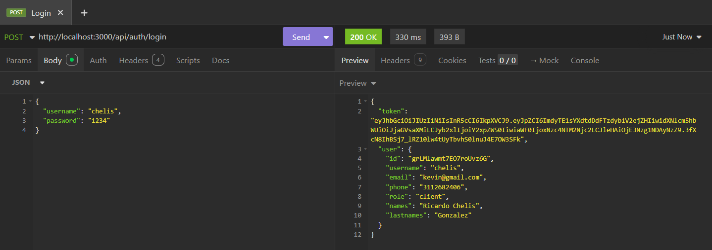

---

# 🛍️ Gestión de Productos

La API permite administrar productos mediante endpoints REST.

## Funcionalidades
- Crear productos
- Obtener productos
- Actualizar productos
- Eliminar productos
- Manejo de stock
- Manejo de categorías

---

## 📸 Evidencias

### Obtener productos

  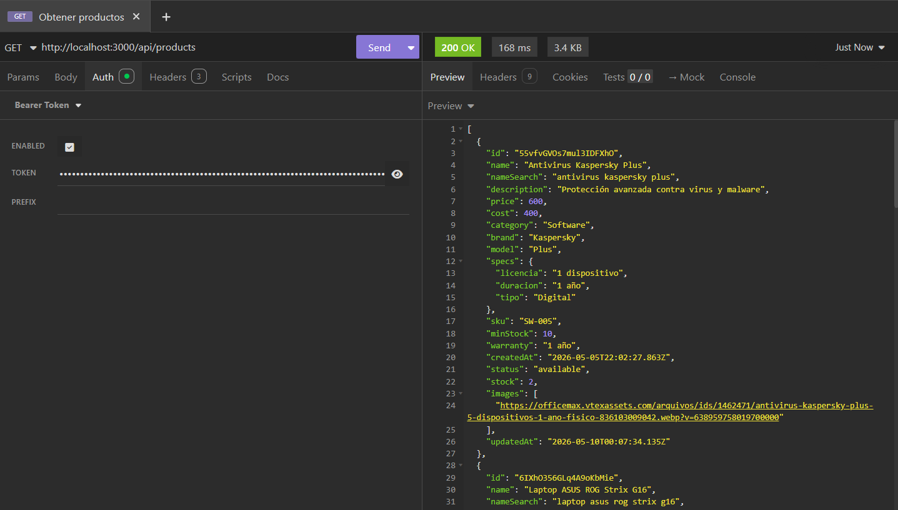

---

### Crear producto

  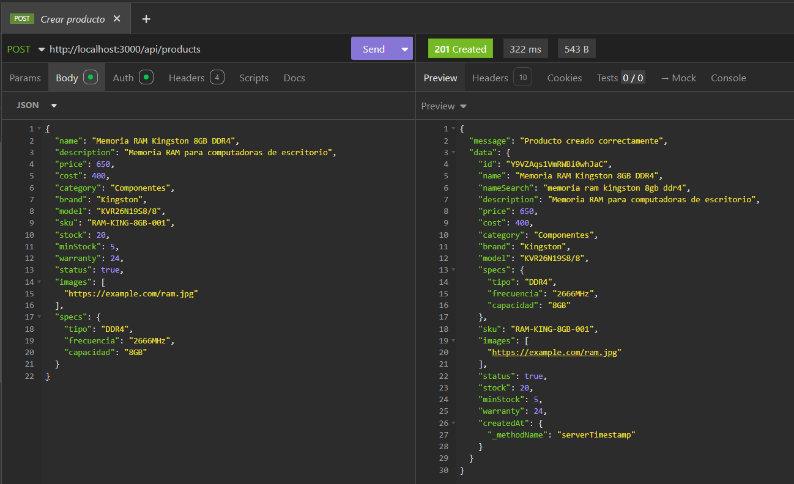

---

# 🛠️ Gestión de Servicios

La API implementa endpoints para la administración de servicios técnicos.

## Funcionalidades
- Registro de servicios
- Consulta de servicios
- Gestión de estados
- Manejo de información técnica

---

## 📸 Evidencias

### Obtener servicios

  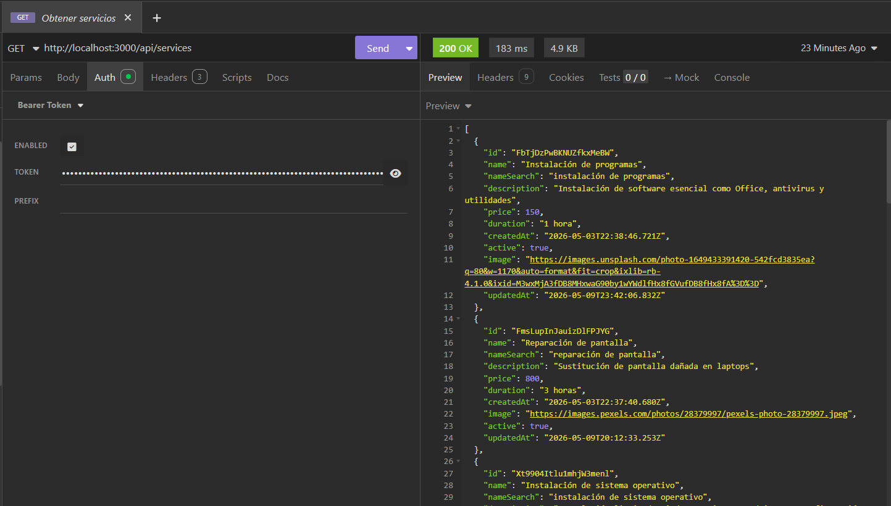

---

### Crear servicio

  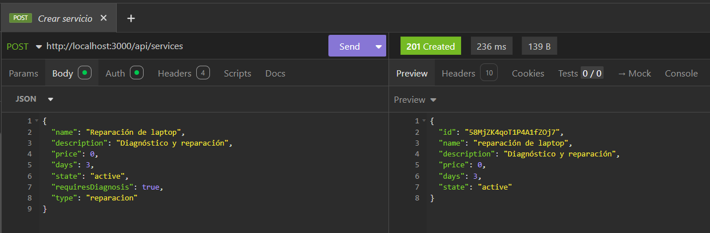

---

# 🧾 Gestión de Pedidos

La API permite registrar y administrar pedidos de productos y servicios.

## Funcionalidades
- Creación de pedidos
- Gestión de estados
- Relación usuario-pedido
- Registro de información del cliente

---

## 📸 Evidencias

### Obtener ordenes

  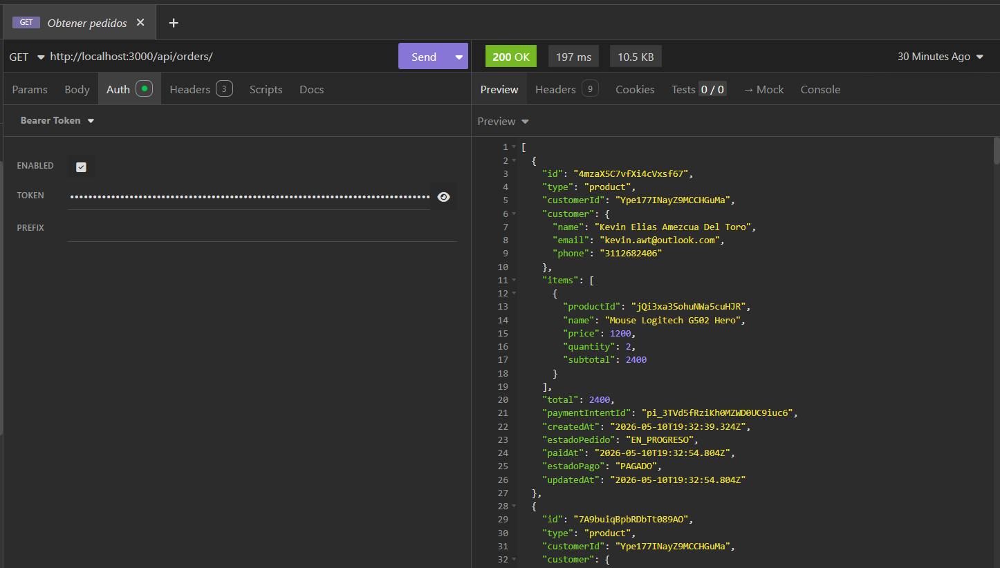

---

### Crear pedido

  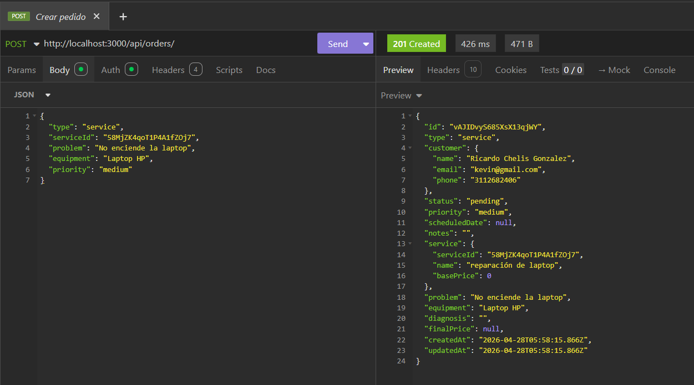

---

# 🔥 Integración con Firebase

El backend utiliza Firebase Firestore como base de datos principal.

## Funcionalidades
- Persistencia de datos
- Colecciones y documentos
- Almacenamiento de productos
- Gestión de usuarios y pedidos

---

## 📸 Evidencias

### Firebase Firestore

  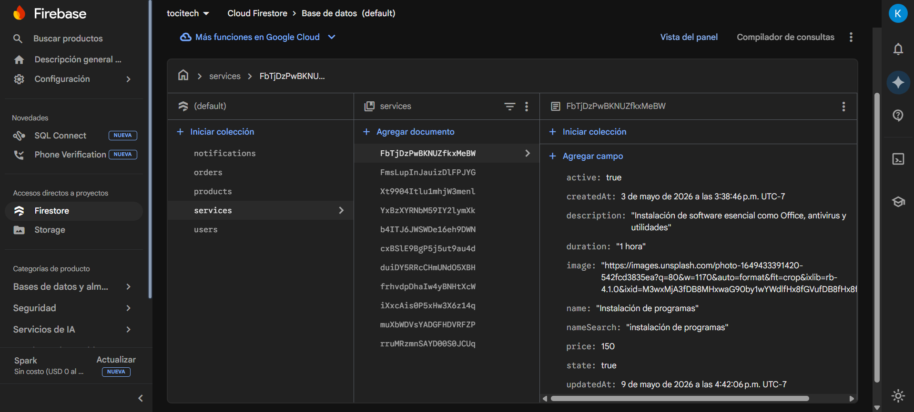

---

# 💳 Integración de Pagos con Stripe

La API integra Stripe para el procesamiento de pagos electrónicos.

## Funcionalidades
- Creación de Payment Intents
- Procesamiento de pagos
- Validación de transacciones
- Flujo seguro de pagos

---

## 📸 Evidencias

### Dashboard Stripe

  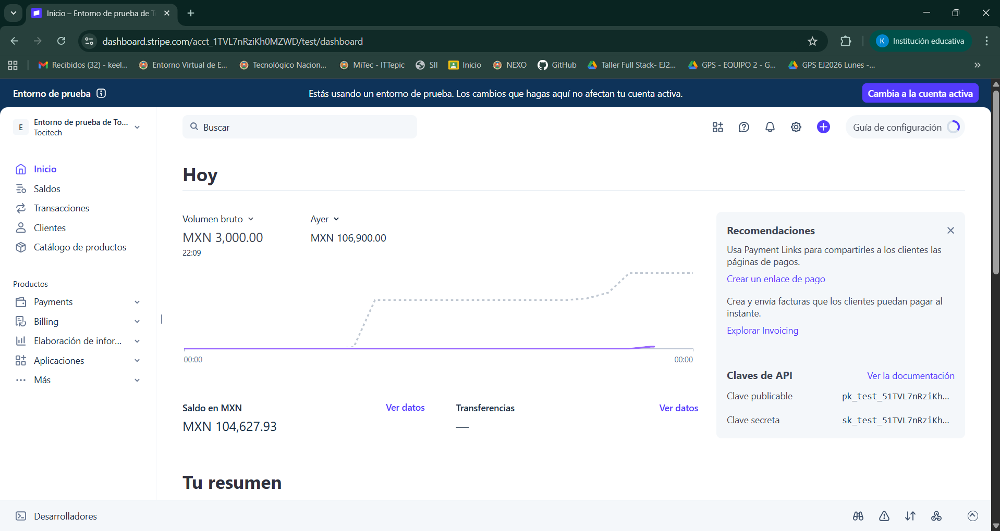

---

# 📧 Integración con SendGrid

El backend implementa envío automático de correos electrónicos utilizando SendGrid.

## Funcionalidades
- Confirmaciones de compra
- Resúmenes de pedidos
- Notificaciones automáticas
- Templates HTML

---

## 📸 Evidencias

### Dashboard SendGrid

  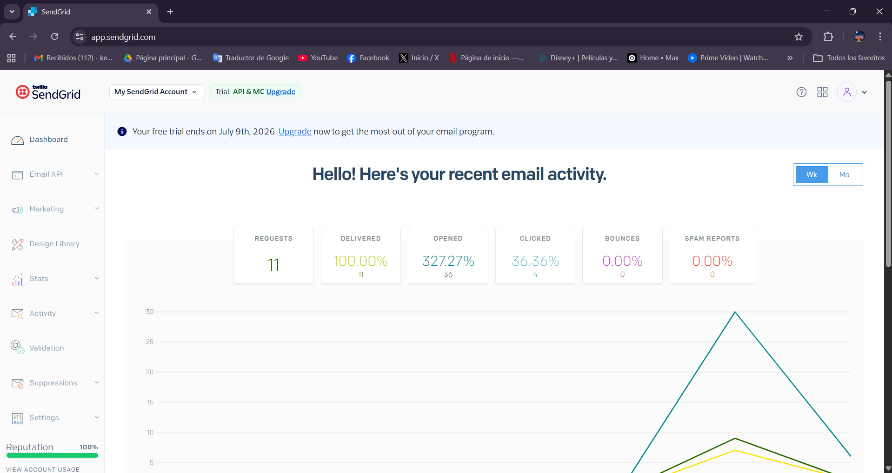

---

# 🔄 API REST

La API fue desarrollada siguiendo principios REST utilizando intercambio de información mediante JSON.

## Endpoints implementados

| Método | Uso |
|---|---|
| GET | Obtener información |
| POST | Crear información |
| PUT | Actualizar información |
| DELETE | Eliminar información |

---

# 🔐 Seguridad Implementada

## Implementaciones
- JWT Authentication
- Middleware de autenticación
- Middleware de roles
- Rate limiting
- Variables de entorno
- Hashing de contraseñas
- Protección de rutas

---

# ☁️ Servicios Externos Integrados

| Servicio | Uso |
|---|---|
| Firebase | Base de datos |
| Stripe | Procesamiento de pagos |
| SendGrid | Correos electrónicos |
| Gemini AI | Funcionalidades inteligentes |

---

# 🖥️ Panel Web Administrativo (web_admin)

El panel administrativo web fue desarrollado utilizando React y Vite como una solución moderna para la administración del sistema TociTech.  
Permite gestionar productos, servicios, pedidos, clientes y estadísticas en tiempo real mediante una interfaz dinámica y responsiva.

---

# 🎯 Objetivos Implementados

- Desarrollo de panel administrativo con React
- Consumo de API REST mediante Axios/HTTP
- Arquitectura modular y escalable
- Gestión completa de productos y servicios
- Administración de pedidos y clientes
- Dashboard con estadísticas y gráficas
- Protección de rutas privadas
- Diseño responsive y moderno

---

# 🛠️ Tecnologías Utilizadas

| Tecnología | Uso |
|---|---|
| React.js | Desarrollo frontend |
| Vite | Entorno de desarrollo |
| JavaScript | Lenguaje principal |
| Tailwind CSS | Diseño UI |
| React Router DOM | Navegación |
| Axios | Consumo de API |
| Firebase Firestore | Base de datos |
| JWT | Autenticación |
| Vercel | Despliegue |
| Recharts | Gráficas y estadísticas |

---

# 📂 Arquitectura del Proyecto

El proyecto implementa una estructura modular organizada por componentes, páginas, rutas y servicios API.

## 📸 Evidencias

### Estructura del proyecto

  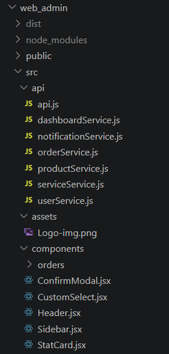
  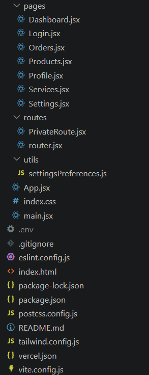

---

# 🚀 Ejecución del Proyecto

La aplicación utiliza Vite para el entorno de desarrollo local.

## 📸 Evidencias

### Servidor de desarrollo

  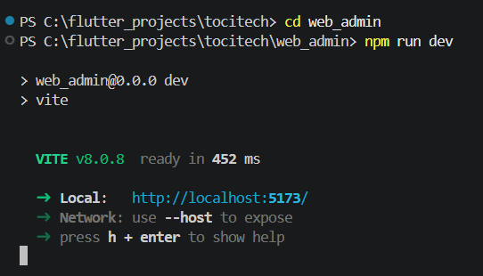

---

# 🔐 Autenticación y Protección de Rutas

El sistema implementa autenticación mediante JWT y rutas privadas para proteger el acceso administrativo.

## Funcionalidades
- Inicio de sesión
- Protección de páginas
- Persistencia de sesión
- Middleware de autenticación

---

# 📊 Dashboard Administrativo

El dashboard muestra estadísticas generales del sistema en tiempo real.

## Funcionalidades
- Resumen de ventas
- Estadísticas de productos
- Servicios registrados
- Inventario
- Actividad semanal
- Gráficas dinámicas

---

## 📸 Evidencias

### Dashboard principal

  

---

# 🛍️ Gestión de Productos

El panel permite administrar el catálogo completo de productos.

## Funcionalidades
- Crear productos
- Editar productos
- Eliminar productos
- Gestión de stock
- Búsqueda y filtros
- Clasificación por categorías

---

## 📸 Evidencias

### Lista de productos

  

---

### Formulario de productos

  
  

---

# 🛠️ Gestión de Servicios

El sistema permite administrar los servicios técnicos disponibles.

## Funcionalidades
- Crear servicios
- Editar servicios
- Eliminar servicios
- Gestión de precios y duración
- Búsqueda dinámica

---

## 📸 Evidencias

### Administración de servicios

  

---

# 🧾 Gestión de Pedidos

El panel permite visualizar y administrar los pedidos realizados por los clientes.

## Funcionalidades
- Visualización de pedidos
- Actualización de estados
- Seguimiento de pagos
- Historial de pedidos
- Filtros de búsqueda

---

## 📸 Evidencias

### Gestión de pedidos

  

---

# 👥 Gestión de Clientes

El sistema incluye un módulo para visualizar clientes registrados.

## Funcionalidades
- Consulta de clientes
- Historial de pedidos activos
- Información de contacto
- Gestión administrativa

---

## 📸 Evidencias

### Lista de clientes

  

---

# 🔄 Consumo de API REST

La aplicación consume servicios REST desarrollados en Node.js mediante peticiones HTTP.

## Funcionalidades implementadas
- GET
- POST
- PUT
- DELETE
- Manejo de errores
- Integración cliente-servidor
- Manejo de tokens JWT

---

# 🎨 Diseño UI/UX

El panel administrativo implementa una interfaz moderna con enfoque en experiencia de usuario.

## Características
- Diseño oscuro moderno
- Componentes reutilizables
- Diseño responsive
- Navegación intuitiva
- Dashboard interactivo
- Feedback visual dinámico
