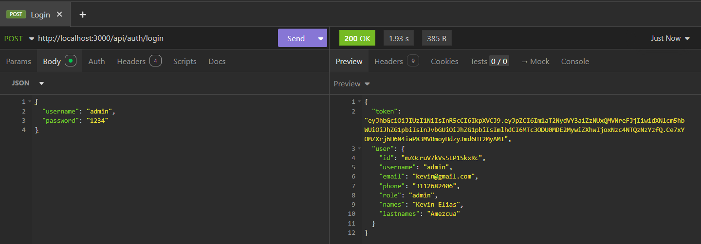
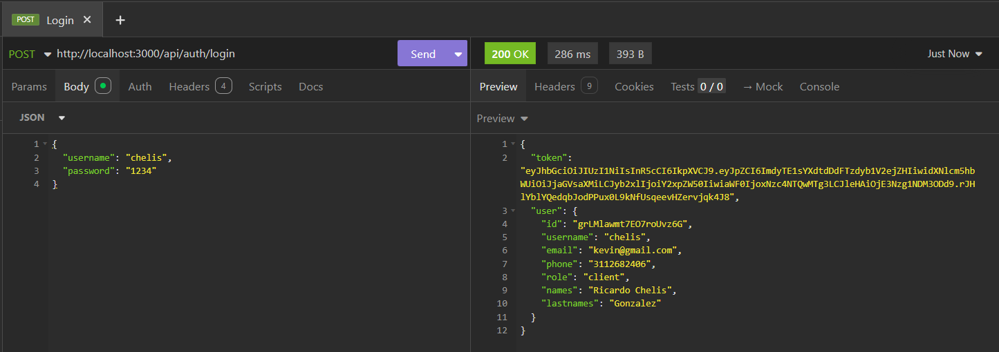
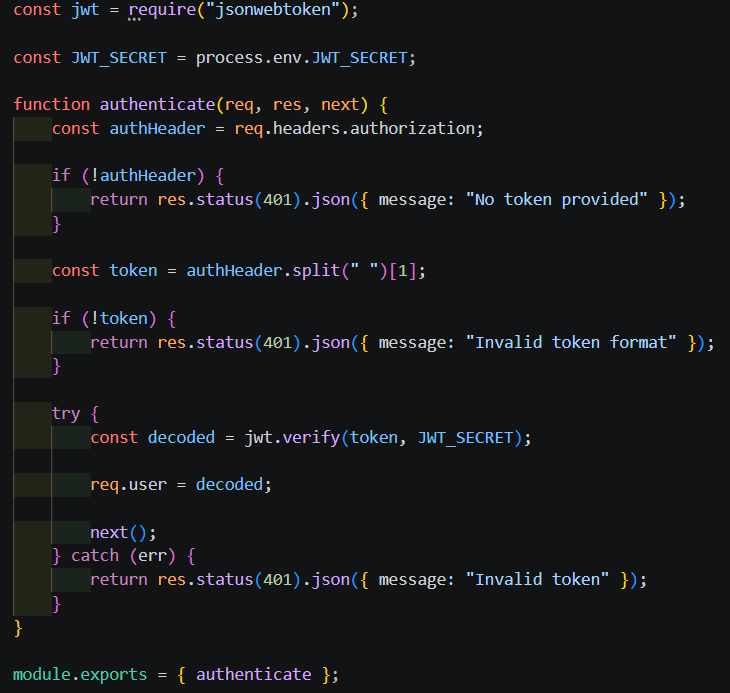
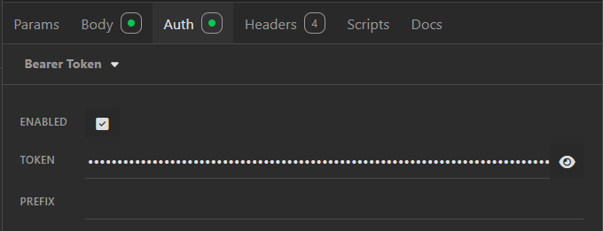
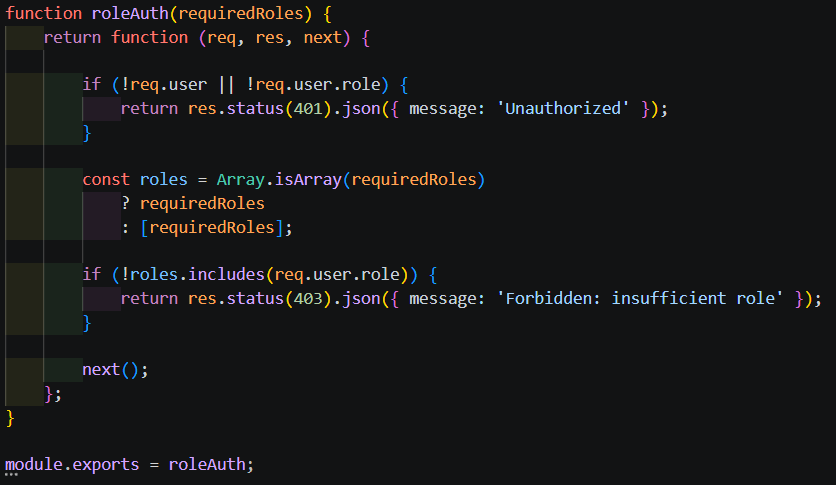
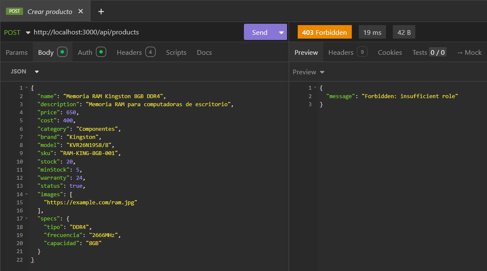
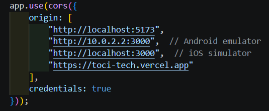
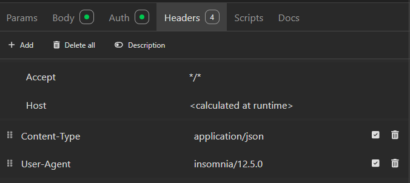

# Sprint 3 - Seguridad y Protección del Sistema

Durante este sprint se implementaron mecanismos de seguridad para proteger la API REST y controlar el acceso al sistema mediante autenticación y autorización basada en JWT.  
También se configuraron políticas de acceso mediante CORS y middleware de validación para asegurar las rutas protegidas del backend.

El objetivo principal fue fortalecer la seguridad entre cliente y servidor, garantizando el acceso controlado a los recursos del sistema.

---

# 🎯 Objetivos Implementados

- Implementación de autenticación con JWT
- Protección de rutas privadas
- Validación de tokens
- Control de acceso basado en roles
- Configuración de CORS
- Manejo seguro de headers HTTP
- Middleware de autenticación y autorización
- Protección de endpoints administrativos

---

# 🛠️ Tecnologías Utilizadas

| Tecnología | Uso |
|---|---|
| Node.js | Entorno backend |
| Express.js | Framework backend |
| JWT | Autenticación |
| Middleware | Protección de rutas |
| CORS | Control de acceso |
| Firebase Firestore | Base de datos |
| Express | API REST |
| JSON | Intercambio de datos |

---

# 🔐 Implementación de JWT

Se implementó autenticación basada en JSON Web Tokens (JWT) para validar la identidad de los usuarios y mantener sesiones seguras entre cliente y servidor.

## Funcionalidades
- Inicio de sesión autenticado
- Generación de tokens JWT
- Validación de sesiones
- Persistencia de autenticación
- Protección de endpoints

---

## 📸 Evidencias

### Login administrador con JWT

  

---

### Login cliente con JWT

  

---

# 🛡️ Middleware de Autenticación

Se desarrolló un middleware encargado de validar tokens JWT enviados desde el cliente mediante headers Authorization.

## Funcionalidades
- Verificación de token
- Validación de formato Bearer
- Manejo de errores 401
- Protección de rutas privadas

---

## 📸 Evidencias

### Middleware authenticate

  

---

### Bearer Token en peticiones

  

---

# 👮 Control de Acceso por Roles

El sistema implementa autorización basada en roles para restringir el acceso a funcionalidades administrativas.

## Funcionalidades
- Roles de usuario
- Validación de permisos
- Protección de recursos administrativos
- Restricción de endpoints

---

## 📸 Evidencias

### Middleware de roles

  

---

### Acceso denegado por permisos insuficientes

  

---

# 🌐 Configuración de CORS

Se configuró CORS para permitir conexiones controladas entre frontend, aplicación móvil y backend.

## Funcionalidades
- Control de orígenes permitidos
- Soporte para frontend web
- Soporte para aplicación Flutter
- Configuración de credenciales

---

## 📸 Evidencias

### Configuración CORS

  

---

# 📡 Configuración de Headers HTTP

La API utiliza headers HTTP adecuados para el envío de información segura entre cliente y servidor.

## Funcionalidades
- Headers JSON
- Authorization Bearer Token
- Content-Type
- Validación de peticiones HTTP

---

## 📸 Evidencias

### Headers HTTP

  

---

# 🔄 Seguridad Cliente-Servidor

El sistema implementa comunicación segura entre frontend, aplicación móvil y backend mediante autenticación centralizada.

## Características
- Tokens JWT
- Validación de usuarios
- Protección de endpoints
- Restricción por roles
- Middleware de seguridad
- Manejo seguro de sesiones

---