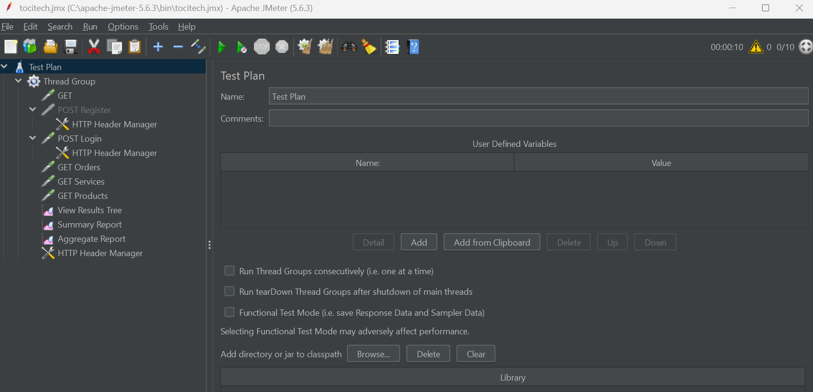
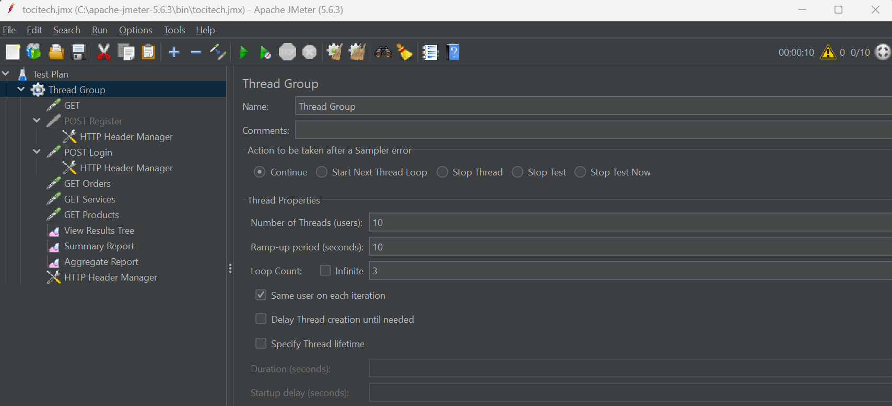
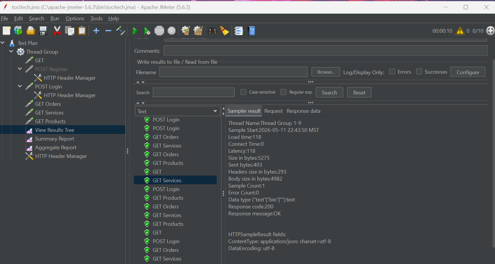
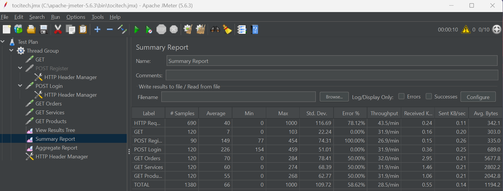
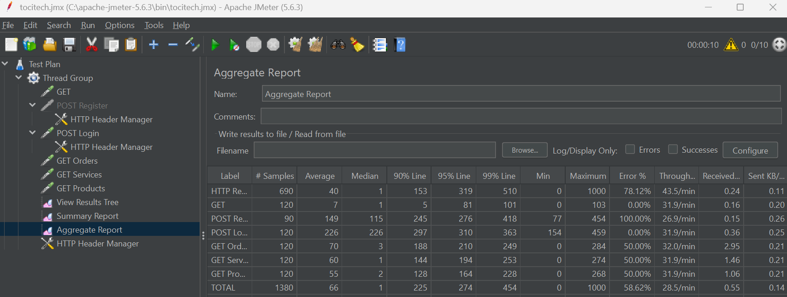
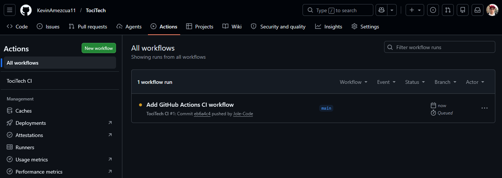
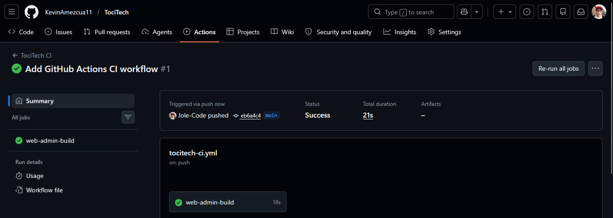

# Sprint 4 - Pruebas, Rendimiento y CI/CD

Durante este sprint se trabajó en la validación del sistema TociTech mediante pruebas de rendimiento y automatización de procesos de integración continua.  
El objetivo principal fue asegurar que la API REST, el panel administrativo y la aplicación pudieran mantenerse estables durante el desarrollo, detectando errores de forma temprana y evaluando el comportamiento del backend ante múltiples peticiones.

El sprint se enfocó principalmente en:

- Pruebas de carga y rendimiento con Apache JMeter
- Automatización de validaciones con GitHub Actions
- Ejecución de pruebas en cada cambio del repositorio
- Revisión de estabilidad de endpoints principales
- Preparación de un flujo CI/CD para despliegues más confiables

---

# Objetivos Implementados

- Diseño de pruebas de rendimiento para la API REST
- Simulación de múltiples usuarios realizando peticiones al backend
- Validación de tiempos de respuesta en endpoints principales
- Identificación de posibles cuellos de botella
- Configuración conceptual de integración continua con GitHub Actions
- Automatización de instalación de dependencias y ejecución de comandos de validación
- Preparación del proyecto para un flujo de entrega continua
- Documentación del proceso de pruebas y despliegue

---

# Tecnologías Utilizadas

| Tecnología | Uso |
|---|---|
| Apache JMeter | Pruebas de carga, estrés y rendimiento |
| GitHub Actions | Automatización CI/CD |
| Node.js | Ejecución y validación del backend |
| Express.js | API REST evaluada durante las pruebas |
| Flutter | Aplicación móvil considerada dentro del flujo de validación |
| React.js | Panel administrativo considerado dentro del flujo de CI |
| Firebase Firestore | Base de datos utilizada por el sistema |
| YAML | Definición de workflows de GitHub Actions |
| npm | Instalación de dependencias y ejecución de scripts |

---

# Apache JMeter

Apache JMeter fue utilizado como herramienta principal para realizar pruebas de rendimiento sobre la API REST de TociTech.  
Estas pruebas permitieron simular usuarios concurrentes enviando peticiones HTTP al backend, con el fin de analizar el comportamiento del servidor bajo diferentes niveles de carga.

## Pruebas realizadas

- Pruebas de carga sobre endpoints públicos
- Pruebas de autenticación mediante inicio de sesión
- Pruebas de consulta de productos
- Pruebas de consulta de servicios
- Pruebas de creación de pedidos
- Validación de tiempos de respuesta
- Revisión de errores HTTP durante la ejecución
- Análisis de rendimiento general del backend

---

# Plan de Pruebas en JMeter

El plan de pruebas se organizó mediante un Thread Group, donde se configuraron usuarios virtuales, tiempo de arranque y número de iteraciones.

## Configuración principal

| Elemento | Descripción |
|---|---|
| Thread Group | Simulación de usuarios concurrentes |
| HTTP Request | Peticiones hacia los endpoints de la API |
| HTTP Header Manager | Configuración de headers como `Content-Type` y `Authorization` |
| JSON Body | Envío de datos para login, pedidos o registros |
| View Results Tree | Revisión individual de respuestas |
| Summary Report | Resumen general de tiempos, errores y throughput |
| Aggregate Report | Análisis consolidado del rendimiento |

---

# Endpoints Evaluados

Durante las pruebas se consideraron los endpoints principales del backend, especialmente aquellos utilizados por la aplicación móvil y el panel administrativo.

| Módulo | Endpoint | Método | Objetivo |
|---|---|---|---|
| Autenticación | `/api/auth/login` | POST | Validar inicio de sesión |
| Productos | `/api/products` | GET | Consultar catálogo de productos |
| Productos | `/api/products` | POST | Crear productos desde administración |
| Servicios | `/api/services` | GET | Consultar servicios técnicos |
| Pedidos | `/api/orders` | GET | Consultar pedidos registrados |
| Pedidos | `/api/orders` | POST | Crear pedidos de productos o servicios |

---

# Métricas Analizadas

JMeter permitió revisar métricas importantes para conocer la estabilidad del sistema.

## Métricas principales

- Tiempo promedio de respuesta
- Tiempo mínimo y máximo de respuesta
- Porcentaje de errores
- Throughput o peticiones procesadas por segundo
- Número de muestras ejecutadas
- Comportamiento del servidor ante usuarios concurrentes

Estas métricas ayudan a determinar si la API mantiene un rendimiento aceptable cuando varios usuarios interactúan con el sistema al mismo tiempo.

---

# GitHub Actions CI/CD

GitHub Actions fue considerado para automatizar tareas de integración continua y entrega continua dentro del repositorio de TociTech.  
El flujo CI/CD permite ejecutar validaciones automáticamente cada vez que se realizan cambios en el código, ayudando a detectar errores antes de integrar nuevas funcionalidades.

## Funcionalidades del flujo CI/CD

- Ejecución automática al hacer `push`
- Ejecución automática al crear un `pull request`
- Instalación de dependencias del backend
- Validación de scripts del proyecto
- Revisión de construcción del panel administrativo
- Preparación para pruebas automatizadas
- Separación de pasos por módulos del sistema

---

# Workflow Propuesto

El workflow de GitHub Actions se define mediante archivos YAML dentro de la carpeta `.github/workflows`.  
Un flujo básico para TociTech puede validar backend y panel web en cada actualización del repositorio.

```yaml
name: TociTech CI

on:
  push:
    branches: [ main ]
  pull_request:
    branches: [ main ]

jobs:
  backend:
    runs-on: ubuntu-latest

    steps:
      - name: Checkout repository
        uses: actions/checkout@v4

      - name: Setup Node.js
        uses: actions/setup-node@v4
        with:
          node-version: 20

      - name: Install backend dependencies
        working-directory: backend
        run: npm install

      - name: Run backend validation
        working-directory: backend
        run: npm test

  web-admin:
    runs-on: ubuntu-latest

    steps:
      - name: Checkout repository
        uses: actions/checkout@v4

      - name: Setup Node.js
        uses: actions/setup-node@v4
        with:
          node-version: 20

      - name: Install web dependencies
        working-directory: web_admin
        run: npm install

      - name: Build web admin
        working-directory: web_admin
        run: npm run build
```

---

# Integración Continua

La integración continua permite validar que los cambios realizados por el equipo no rompan funcionalidades existentes.

## Validaciones contempladas

- Instalación correcta de dependencias
- Compilación del panel administrativo
- Ejecución de pruebas del backend
- Revisión de errores durante el build
- Validación automática antes de integrar cambios a la rama principal

Este proceso mejora la calidad del proyecto porque reduce errores manuales y facilita el trabajo colaborativo.

---

# Entrega Continua

La entrega continua prepara el proyecto para automatizar despliegues después de pasar las validaciones de CI.

## Beneficios

- Despliegues más controlados
- Menor riesgo al publicar cambios
- Validación previa antes de producción
- Historial claro de ejecuciones
- Mayor confianza al integrar nuevas funcionalidades

En futuras etapas, este flujo puede conectarse con plataformas de despliegue como Vercel, Render, Railway o Firebase Hosting.

---

# Flujo General de Pruebas y CI/CD

```text
Desarrollador realiza cambios
        |
        v
Push o Pull Request en GitHub
        |
        v
GitHub Actions ejecuta workflow
        |
        v
Instalación de dependencias
        |
        v
Ejecución de pruebas y validaciones
        |
        v
Build del panel administrativo
        |
        v
Resultado aprobado o fallido
        |
        v
Preparación para despliegue
```

## Evidencia 1 - Plan de pruebas en Apache JMeter

<p align="center">
  
</p>

---

## Evidencia 2 - Thread Group configurado

<p align="center">
  
</p>

---

## Evidencia 3 - Peticiones HTTP hacia la API

<p align="center">
  
</p>

---

## Evidencia 4 - Summary Report de JMeter

<p align="center">
  
</p>

---

## Evidencia 5 - Aggregate Report de JMeter

<p align="center">
  
</p>

---

## Evidencia 6 - Workflow de GitHub Actions

<p align="center">
  
</p>

---

## Evidencia 7 - Ejecución exitosa del pipeline

<p align="center">
  
</p>

---

# Conclusión

El Sprint 4 permitió fortalecer la calidad del sistema TociTech mediante pruebas de rendimiento y automatización de validaciones.  
Apache JMeter ayudó a evaluar el comportamiento de la API ante múltiples peticiones, mientras que GitHub Actions estableció las bases para un flujo CI/CD capaz de validar el proyecto de forma automática.

Con estas herramientas, el sistema queda mejor preparado para crecer, recibir nuevas funcionalidades y reducir riesgos durante futuras integraciones.
