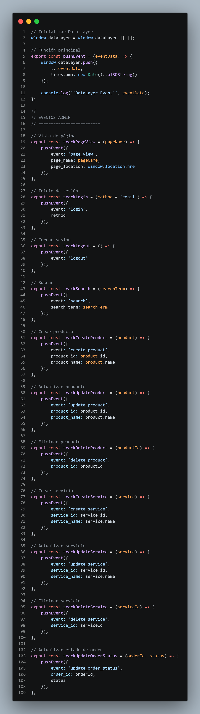
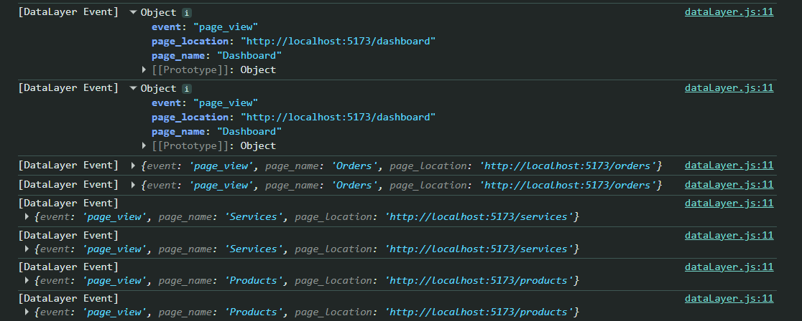
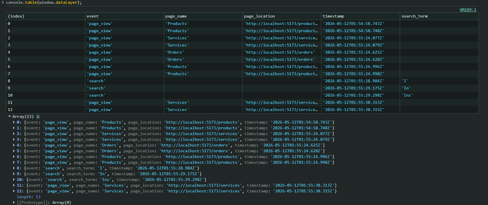

# 📊 Sprint 5 - Analítica

Durante este sprint se trabajó en la implementación de herramientas básicas de analítica dentro del sistema TociTech.  

El objetivo principal fue comenzar a registrar y analizar información sobre la interacción de los usuarios dentro del panel administrativo, utilizando una estructura de eventos personalizada mediante Data Layer.

Esto permitirá en futuras etapas integrar herramientas de analítica avanzadas como Google Analytics 4 o Firebase Analytics para visualizar métricas, comportamiento de usuarios y eventos del sistema.

---

# 🎯 Objetivos Implementados

- Implementación de estructura básica de Data Layer
- Registro de eventos personalizados
- Seguimiento de navegación
- Monitoreo de acciones administrativas
- Captura de eventos en tiempo real
- Preparación para integración con herramientas Analytics

---

# 🛠️ Tecnologías Utilizadas

| Tecnología | Uso |
|---|---|
| JavaScript | Implementación del Data Layer |
| React.js | Integración de eventos |
| Vite | Entorno frontend |
| Browser Console | Validación de eventos |
| Data Layer | Registro de analítica |
| JSON | Estructura de eventos |

---

# 📡 Implementación del Data Layer

Se implementó una estructura básica de Data Layer en el panel administrativo de TociTech para registrar eventos importantes del sistema.

Primero se creó un archivo `dataLayer.js`, donde se inicializó `window.dataLayer` y se definieron funciones para enviar eventos mediante `pushEvent()`.

Después se agregaron eventos personalizados para las principales acciones del sistema:

- `login`
- `logout`
- `page_view`
- `search`
- `create_product`
- `update_product`
- `delete_product`
- `create_service`
- `update_service`
- `delete_service`
- `update_order_status`

---

# 🔄 Integración con Componentes

Los eventos fueron integrados en distintos componentes del proyecto para registrar automáticamente las acciones realizadas por el usuario.

## Componentes integrados

- `Login.jsx`
- `Dashboard.jsx`
- `Products.jsx`
- `Services.jsx`
- `Orders.jsx`
- `Header.jsx`

Cada vez que el usuario realiza una acción importante, el sistema registra automáticamente el evento dentro de `window.dataLayer` junto con un `timestamp`.

---

## 📸 Evidencias

### Archivo dataLayer.js

<p align="center">
  
</p>

---

# 📊 Registro de Eventos

Se realizaron pruebas utilizando la consola del navegador para validar el correcto funcionamiento del Data Layer.

Para visualizar los eventos registrados se utilizó:

```javascript
console.table(window.dataLayer)
```

Esto permitió monitorear todos los eventos generados en tiempo real.

---

## 📸 Evidencias

### Eventos registrados en consola

<p align="center">
  
</p>

---

### Visualización completa de window.dataLayer

<p align="center">
  
</p>

---
